# Architecture Design Document: Realtor Tax Bot Service

## 1. Overview
The **Realtor Tax Bot** is a high-performance Telegram interface designed to calculate real estate transaction taxes in the Republic of Belarus. The service provides instantaneous tax estimations based on dynamic currency exchange rates and statutory "Basic Value" (BV) tiers.

The system supports two interaction modes:
1.  **Direct Chat:** Standard command-based interaction (`/start`, text input).
2.  **Inline Mode:** Low-latency queries triggered from any chat context.

The platform includes a monetization layer (subscription-gated features) and a comprehensive analytics pipeline to track user engagement (DAU/MAU) and revenue.

## 2. Design Goals

### 2.1. Functional Requirements
*   **Tax Calculation:** Compute tax in BYN and USD based on the input property value (USD). Logic must adhere to the progressive percentage scale defined by legislation.
*   **Inline Query Support:** Provide instant calculation results via Telegram Inline Mode.
*   **Monetization:** Restrict advanced features or detailed reports to premium subscribers.
*   **Analytics:** Track daily/monthly active users and calculation volume.

### 2.2. Non-Functional Requirements
*   **Latency:** Inline query response time must be under **500ms** (P95) to prevent UI timeouts in the Telegram client.
*   **Availability:** 99.9% uptime. The system must remain functional (using cached rates) even if the National Bank (NBRB) API is unreachable.
*   **Scalability:** Capable of handling concurrent requests without blocking the event loop.
*   **Data Integrity:** Subscription status must be strictly consistent between the payment provider and the application database.

## 3. System Architecture

The system follows a **Layered Architecture** pattern with a strict separation of concerns between the transport layer (Telegram), business logic, and data access.

### 3.1. High-Level Diagram

### 3.2. Technology Stack
*   **Runtime:** Python 3.12
*   **Framework:** `aiogram 3.x` (Asynchronous, Type-safe)
*   **Database:** PostgreSQL 18 (Persistent storage for users, transactions, logs)
*   **Cache:** Redis 8.x (Hot storage for session state, rates, and subscription cache)
*   **ORM:** SQLAlchemy 2.0 (Async)
*   **Migrations:** Alembic
*   **Scheduler:** APScheduler (Rate synchronization)

## 4. Component Design

### 4.1. Transport Layer (Bot Handlers)
Handles protocol-specific logic (Telegram API).
*   **Inline Handler:** Optimized for speed. Parses input regex `^\d+$`. Retrieves currency rates from Redis (O(1)) instead of the database.
*   **Payment Handlers:** Processes `PreCheckoutQuery` and `SuccessfulPayment` events.

### 4.2. Middleware Layer
Interceptors that execute before the business logic.
1.  **SubscriptionMiddleware:**
    *   Checks Redis key `sub:{user_id}`.
    *   **Cache Hit:** Injects `is_premium=True/False` into the handler context.
    *   **Cache Miss:** Queries PostgreSQL, populates Redis (TTL 5 mins), and injects status.
2.  **AnalyticsMiddleware:**
    *   Updates `last_seen` timestamp for the user.
    *   Persists interaction events to the `analytics_events` table asynchronously.

### 4.3. Service Layer
Pure Python classes independent of the Telegram API.
*   **CalculatorService:** Implements the tax logic. Dependencies: `amount`, `rate`, `basic_value`.
*   **RateService:** background job that polls the NBRB API every 60 minutes. Updates Redis key `currency:usd`. Implements circuit breaker logic (if API fails, stale cache is preserved).

## 5. Data Model

### 5.1. Database Schema (PostgreSQL)

**Table: `users`**
| Column | Type | Description |
| :--- | :--- | :--- |
| `tg_id` | BIGINT (PK) | Telegram User ID |
| `is_premium` | BOOLEAN | Subscription status flag |
| `premium_expires_at` | TIMESTAMPTZ | Subscription expiration date |
| `created_at` | TIMESTAMPTZ | Registration date |

**Table: `analytics_events`**
| Column | Type | Description |
| :--- | :--- | :--- |
| `id` | BIGSERIAL (PK) | Auto-increment ID |
| `user_id` | BIGINT (FK) | Reference to `users.tg_id` |
| `event_type` | VARCHAR | Enum: `calc_inline`, `buy_attempt` |
| `created_at` | TIMESTAMPTZ | Timestamp of the event |
| `payload` | JSONB | Context (e.g., input amount) |

### 5.2. Caching Strategy (Redis)

| Key Pattern | Type | TTL | Description |
| :--- | :--- | :--- | :--- |
| `sub:{user_id}` | String (Bool) | 300s | User subscription status to reduce DB load |
| `currency:usd` | String (Float) | 24h | Current USD/BYN exchange rate |
| `fsm:{user_id}:{chat_id}` | Hash | Persistent | Aiogram Finite State Machine data |

## 6. Critical Flows

### 6.1. Inline Query Execution
To ensure low latency:
1.  User types `@bot 50000`.
2.  Telegram sends `InlineQuery` update.
3.  **Middleware:** Checks Redis for subscription status.
4.  **Handler:**
    *   Validates input (digits only).
    *   Fetches USD rate from Redis.
    *   Calculates tax (CPU bound).
    *   Constructs `InlineQueryResultArticle`.
5.  **Return:** Sends results with `cache_time=10` to allow client-side caching.
6.  **Async:** Background task logs the event to PostgreSQL.

### 6.2. Subscription Activation
1.  User initiates payment via `/buy`.
2.  Payment provider confirms transaction (`SuccessfulPayment` update).
3.  **System Action:**
    *   UPDATE `users` SET `premium_expires_at` = NOW() + 30 days.
    *   **Invalidate Cache:** DELETE `sub:{user_id}` in Redis.
    *   Notify user of success.

## 7. Configuration & Security

### 7.1. Environment Variables
All configuration is injected via environment variables. No defaults are hardcoded in the source.

*   `BOT_TOKEN`: Telegram API token.
*   `DB_DSN`: PostgreSQL connection string (AsyncPG driver).
*   `REDIS_URL`: Redis connection string.
*   `BASIC_VALUE_BYN`: The statutory base value (float). Configurable via CI/CD variables without code deployment.

### 7.2. Secrets Management
*   Secrets are not stored in the repository.
*   In production, secrets are injected via the container orchestration platform (Docker/K8s).

## 8. Observability

### 8.1. Metrics
The system relies on SQL-based aggregation for business metrics, visualized via BI tools (e.g., Metabase) connected to a read-replica of the database.
*   **DAU:** `SELECT count(DISTINCT user_id) FROM analytics_events WHERE created_at > now() - interval '1 day'`
*   **Revenue:** Aggregation of `transactions` table.

### 8.2. Logging
Structured JSON logging is used for all application logs to facilitate ingestion by log aggregators (ELK/Datadog).

## 9. Future Considerations
*   **Horizontal Scaling:** The bot is stateless. Multiple instances can be deployed behind a load balancer (Webhook mode required) using the same Redis/DB instances.
*   **Rate Limiting:** If abuse is detected, a Throttling Middleware using Redis generic cell rate algorithm (GCRA) should be implemented.